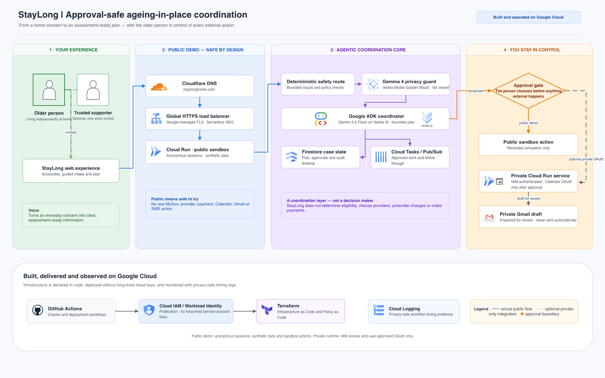

# StayLong

> Approval-safe coordination for independent living at home.

StayLong helps older Australians who live alone remain independent at home for longer. It turns an everyday home-living concern into clear, assessment-ready information and a plan of approved next steps.

It is an approval-safe coordination companion, not a generic chatbot, care provider or eligibility decision-maker. An older person can work independently, or invite an authorised trusted supporter only for a specific task and only when they choose.

## What it does

- Captures a non-emergency concern in plain language, such as difficulty reaching the bathroom safely at night.
- Uses deterministic safety routing before any model-assisted planning.
- Prepares an assessment-ready summary and practical notes for the person to review.
- Proposes bounded next steps and keeps them waiting until the person approves.
- Records approved follow-through, reminders and outcomes in an auditable case timeline.
- Lets the person decide whether and when to involve a trusted supporter.

## Product principles

- **The older person stays in control.** Consent to involve someone is separate from approval to take an external action.
- **One clear step at a time.** The experience reduces coordination burden without pressuring the person to disclose more than needed.
- **Public means safe to try.** The public demonstration uses anonymous sessions, synthetic data and sandbox actions only.
- **Approval is an action boundary.** StayLong does not send information, create a booking or use an external account without recorded approval.
- **Privacy is bounded by design.** A Gemma privacy guard removes unnecessary personal information before persistence or planning, and fails closed if its response is invalid.
- **Official pathways remain with the person.** StayLong prepares and coordinates; it does not access MyGov, determine eligibility, select providers, prescribe modifications or make payments.

## Architecture at a glance



StayLong runs on Google Cloud with Google ADK, Gemini 3.6 Flash and a Gemma 4 privacy guard. An explicit approval gate separates a proposed step from any external action. The public demonstration cannot create real Calendar, Gmail, provider, payment, My Aged Care or MyGov actions; private Calendar OAuth and Gmail draft preparation are available only in the authenticated private runtime after user approval. See the complete [architecture and boundary documentation](docs/architecture.md).

## Public demonstration

The long-lived demonstration is available at [staylonghome.com](https://staylonghome.com). It is a temporary-data demonstration, not a production care service. The generated Cloud Run URL remains available as a rollback path; only an explicitly reviewed `public_edge_lockdown_enabled=true` configuration restricts Cloud Run traffic to the managed load balancer and branded URL.

## Privacy and safety boundaries

The public-sandbox runtime passes concern text through Vertex Model Garden MaaS `gemma-4-26b-a4b-it-maas` before persistence or tool actions. Gemini 3.6 Flash remains the primary ADK coordinator; Gemma returns only a strict privacy contract and cannot change safety, consent or approval transitions. If the privacy guard is unavailable or returns invalid output, the workflow fails closed without persisting the concern or starting a plan.

## What it is—and is not

StayLong helps older people and their chosen supporters prepare, coordinate and track. It sits between family care apps, provider operations software and My Aged Care: it does **not** deliver care, diagnose health conditions, prescribe home modifications, determine AT-HM eligibility, submit government forms, select a provider, or make payments. For acute emergencies or immediate danger, StayLong immediately halts workflow progression and directs users to call Triple Zero (000). Human confirmation is required before every external action or information disclosure.

## Technology and implementation

StayLong uses Gemini 3.6 Flash through Vertex AI, Google ADK, Vertex Model Garden MaaS Gemma 4, and Google Cloud services including Cloud Run, Firestore, Cloud Tasks, Pub/Sub and Cloud Logging. Terraform defines cloud infrastructure and policies; GitHub Actions uses Workload Identity Federation rather than long-lived cloud keys.

## Documentation

See the [product brief](docs/product-brief.md) for policy context, MVP workflow and safety boundaries; the public [architecture](docs/architecture.md) explains the runtime, approval and deployment boundaries.

Competition requirements and evidence are recorded in [competition references](docs/competition-references.md) and [submission readiness](docs/devpost-submission-readiness.md).

The single source-of-truth capability mapping is in the [capability matrix](docs/capability-matrix.md).
The locked stack and live-submission compliance checklist are in [technology and compliance](docs/technology-and-compliance.md).
The additional Gemma privacy integration is documented in [Gemma privacy guard](docs/gemma-privacy.md).
Task documentation, human-action gates and pull-request practice follow the [delivery standards](docs/delivery-standards.md).
Official Google training and the implementation choices it drives are in [official training guidance](docs/official-training-guidance.md).

## Quickstart and local development

```bash
# 1. Install dependencies
pip install -e ".[dev]"

# 2. Run automated test suite
python -m pytest

# 3. Start local API server with static web UI
python -m uvicorn staylong.api.main:app --port 8080
```

## Repository layout

- `src/staylong/` — application package (FastAPI API, Google ADK agents, Gemma privacy guard, domain models, policy engines, and coordination services)
- `tests/` — automated unit, integration, and infrastructure test suites
- `infra/terraform/` — Google Cloud infrastructure definitions (Sydney `australia-southeast1`)
- `.github/workflows/` — CI, Terraform, and Cloud Run deployment automation
- `docs/release-evidence.md` — release-candidate evidence packet and the live verification gate
- `docs/capability-matrix.md` — single source-of-truth matrix mapping capabilities to code and tests
- `docs/` — product, architecture, prompt, competition and delivery documentation

## Runtime container and smoke test

The Cloud Run image is built from [`Dockerfile`](Dockerfile) and starts
`staylong.api.main:app` on the platform-provided `PORT` (default `8080`). The
**private** runtime requires the `STAYLONG_API_TOKEN` environment variable; it
is never checked into the repository or printed by the smoke test. The
**public sandbox** intentionally has no shared API token and accepts only its
scoped cookie-session routes. Pull requests build the image and run
[`tools/cloudrun_smoke.py`](tools/cloudrun_smoke.py) against a local container,
while the private deployment workflow runs health and authenticated case-flow
checks against the deployed URL. Configure `STAYLONG_API_TOKEN` as a masked
`sandbox` GitHub Environment secret only for the private-runtime deployment
path.

The repeatable UI/API workflow contract lives in
[`tests/api/test_ui_workflow.py`](tests/api/test_ui_workflow.py). It loads the
served HTML, verifies the browser form controls and JavaScript entry point,
then submits the same authenticated request and reads the resulting concern
trail through the API. It runs with the normal `pytest` command and does not
require a live Cloud Run service.

## Development status

The core application, multi-step coordination workflows, deterministic safety policies, Gemma privacy guard, Google Calendar integration, public sandbox, and Sydney Cloud Run infrastructure are fully implemented and verified with automated test suites.
