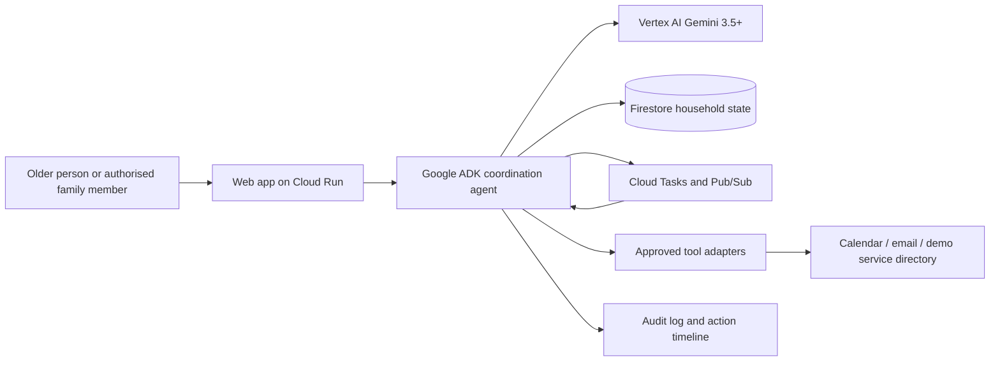

# StayLong technical architecture

## Architecture goal

Build a small, demonstrable Taskmaster that persists a household coordination plan, reacts to events, seeks approval for consequential actions, and records an auditable result.

## Components

| Component | Responsibility |
|---|---|
| Cloud Run web/API service | Authenticated web UI, API, webhook receiver and ADK entry point. |
| Google ADK | Plans and executes a bounded workflow through typed tools. |
| Vertex AI Gemini | Extracts structured concerns, drafts plain-language summaries and proposes next permitted actions. |
| Firestore | Stores household consent, concern records, task state, approvals, action history and idempotency keys. |
| Cloud Tasks | Schedules due-date checks, reminder retries and escalation work. |
| Pub/Sub | Carries event notifications such as `concern.created`, `approval.granted`, `task.overdue` and `assessment.outcome.recorded`. |
| Tool adapters | Calendar, email/SMS and provider-directory adapters. Each adapter validates authority and returns a structured result. |
| Evaluation fixtures | Synthetic cases that test safety routing, approval enforcement, recovery and idempotent actions before deployment. |

## Core event flow

1. An authorised family member creates a concern.
2. The API performs deterministic red-flag screening before invoking Gemini.
3. The intake agent produces a typed concern summary and lists missing facts.
4. The coordinator creates only allowed draft tasks, appointments or messages.
5. A human approves each external side effect.
6. The action tool executes once, records an idempotency key, and emits an event.
7. A scheduled worker detects overdue work and escalates according to household rules.
8. An assessment outcome moves the case to the next workflow stage; it never creates a clinical prescription or funding decision.

## Workflow integrity

- `CaseStatus` is a closed application-level state machine. Gemini may produce structured facts and drafts within a state but cannot choose a safety, consent or approval transition.
- Each persisted checkpoint includes the case state/version, workflow version, correlation ID, wake-up time and required approval reference.
- Before an external call, the service writes an immutable action intent and atomically claims its idempotency key. A retry returns the saved result instead of performing the action again.
- A Cloud Tasks worker re-reads the latest case before acting. A stale or superseded task exits without a side effect.
- The model receives a minimum typed context envelope rather than unrestricted household history. Versioned preparation packs are case artifacts visible to the approver.

The design rationale and MVP priorities are recorded in [training-informed improvements](training-informed-improvements.md).

## Security and privacy boundaries

- Store the minimum personal data needed for the demo; use synthetic household data by default.
- Separate household consent from action approval; consent is not blanket authority to spend, book or disclose.
- Do not ingest MyGov credentials or integrate with My Health Record.
- Encrypt data in transit and at rest using managed Google Cloud controls.
- Use least-privilege service accounts; the Cloud Run runtime identity may access only its Firestore, Cloud Tasks, Pub/Sub and logging resources.
- Never send a message, create a booking or share personal data until a confirmed approval is stored.

## Emergency handling

Emergency handling is a static, deterministic route, not an LLM feature. A possible immediate danger shows emergency information and an authorised family alert option. In Australia, serious or urgent emergencies require calling Triple Zero (000); the product does not delay this action or attempt clinical triage.

## Deployment architecture

- Terraform provisions Google Cloud resources.
- GitHub Actions authenticates to Google Cloud using OpenID Connect Workload Identity Federation (WIF); no JSON service-account key is stored in GitHub.
- CI runs formatting, linting and tests on every pull request.
- Terraform plan runs on pull requests; apply is manually dispatched from protected `main` after review.
- Cloud Run deployment is manually dispatched from `main` after Terraform has provisioned prerequisites.
