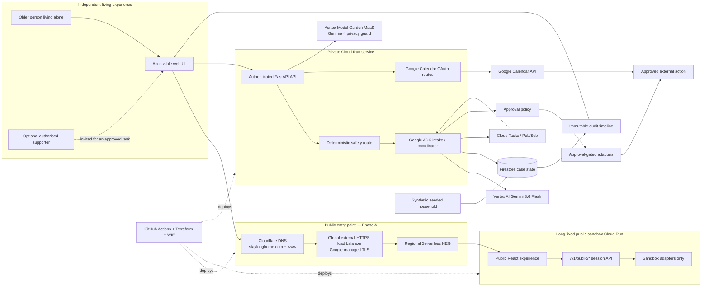

# StayLong technical architecture

## Architecture goal

Build a small, demonstrable Taskmaster that persists a household coordination plan, reacts to events, seeks approval for consequential actions, and records an auditable result.

The demo seed is [`fixtures/demo/seeded-household.json`](../fixtures/demo/seeded-household.json). It exercises the normal concern → intake → draft → human approval path with synthetic identifiers only; it does not represent a real household or execute an external side effect.

## Components

| Component | Responsibility |
|---|---|
| Cloud Run web/API service | Authenticated web UI, API, webhook receiver and ADK entry point. |
| Google ADK | Plans and executes a bounded workflow through typed tools. |
| Vertex AI Gemini 3.6 Flash | Extracts structured concerns, drafts plain-language summaries and proposes next permitted actions. |
| Vertex Model Garden MaaS Gemma 4 privacy guard | Uses request-based `gemma-4-26b-a4b-it-maas` to redact unnecessary PII before concern text is persisted or reaches an action boundary; it cannot make workflow or safety decisions. |
| Firestore | Stores household consent, concern records, task state, approvals, action history and idempotency keys. |
| Cloud Tasks | Schedules due-date checks, reminder retries and escalation work. |
| Pub/Sub | Carries event notifications such as `concern.created`, `approval.granted`, `task.overdue` and `assessment.outcome.recorded`. |
| Tool adapters | Public sandbox adapters record simulation results only. The private Calendar adapter uses user-bound OAuth and runs only after matching approval; email remains draft-only and SMS remains a recording adapter. |
| Evaluation fixtures | Synthetic cases that test safety routing, approval enforcement, recovery and idempotent actions before deployment. |

## Core event flow

1. An older person living alone creates a concern independently, or an authorised supporter creates one with the person's permission.
2. The API performs deterministic red-flag screening before invoking any model.
3. For a non-emergency concern, Gemma redacts unnecessary PII. An unavailable or invalid privacy response fails closed before persistence or planning.
4. The intake agent produces a typed concern summary and lists missing facts.
5. The coordinator creates only allowed draft tasks, appointments or messages.
6. A human approves each external side effect.
7. The action tool executes once, records an idempotency key, and emits an event.
8. A scheduled worker detects overdue work and escalates according to household rules.
9. An assessment outcome moves the case to the next workflow stage; it never creates a clinical prescription or funding decision.

## Workflow integrity

- `CaseStatus` is a closed application-level state machine. Gemini may produce structured facts and drafts within a state but cannot choose a safety, consent or approval transition.
- Each persisted checkpoint includes the case state/version, workflow version, correlation ID, wake-up time and required approval reference.
- Before an external call, the service writes an immutable action intent and atomically claims its idempotency key. A retry returns the saved result instead of performing the action again.
- A Cloud Tasks worker re-reads the latest case before acting. A stale or superseded task exits without a side effect.
- The model receives a minimum typed context envelope rather than unrestricted household history. Versioned preparation packs are case artifacts visible to the approver.

The design rationale and MVP priorities are recorded in [training-informed improvements](training-informed-improvements.md).

Gemma is enabled with `STAYLONG_GEMMA_ENABLED=true` in the sandbox runtime and uses the request-based Vertex Model Garden MaaS model `gemma-4-26b-a4b-it-maas` at `global`; no dedicated GPU endpoint is provisioned. Its response is schema-validated (`redacted_text` plus `detected_categories`); malformed, empty or unavailable output returns a safe retry response before the workflow persists a concern or starts the Gemini/ADK planning path. The privacy layer is separate from deterministic emergency routing and the Gemini/ADK planning agent.

## Security and privacy boundaries

- Store the minimum personal data needed for the demo; use synthetic household data by default.
- Separate household consent from action approval; consent is not blanket authority to spend, book or disclose.
- Do not ingest MyGov credentials or integrate with My Health Record.
- Encrypt data in transit and at rest using managed Google Cloud controls.
- Use least-privilege service accounts; the Cloud Run runtime identity may access only its Firestore, Cloud Tasks, Pub/Sub and logging resources.
- Never send a message, create a booking or share personal data until a confirmed approval is stored.
- The public sandbox cannot reach private OAuth routes or Google APIs, even when a
  browser supplies an arbitrary token or cookie.
- The older person decides whether to invite a supporter. The application does not silently notify family, friends or services.

## Emergency handling

Emergency handling is a static, deterministic route, not an LLM feature. A possible immediate danger shows emergency information and an authorised family alert option. In Australia, serious or urgent emergencies require calling Triple Zero (000); the product does not delay this action or attempt clinical triage.

## Deployment architecture

- Terraform provisions all Google Cloud resources, including identity, state storage, runtime, data stores, messaging, observability and the public edge: global load balancer, Google-managed certificate, Serverless NEG and Cloudflare DNS records.
- GitHub Actions authenticates to Google Cloud using OpenID Connect Workload Identity Federation (WIF); no JSON service-account key is stored in GitHub.
- CI runs formatting, linting and tests on every pull request.
- Terraform plan runs on pull requests; apply is manually dispatched from protected `main` after review.
- Cloud Run deployment is manually dispatched from `main` after Terraform has provisioned prerequisites.
- The long-lived public sandbox is updated in place so its generated `run.app`
  URL remains stable; its explicit destroy workflow is never part of normal
  deployment. Private OAuth services are separate and require an authenticated
  identity-aware request.
- The branded public entry point is `https://staylonghome.com`, served by a global external HTTPS Load Balancer, Google-managed TLS certificate and Serverless NEG in front of Cloud Run; direct Cloud Run domain mapping is not used. During Phase A, the existing generated `run.app` URL remains available as a rollback path. Phase B can restrict direct Cloud Run access only after branded-domain TLS, smoke tests and evidence have passed.

The detailed boundary, lifecycle controls and DNS-token handling are in the
[public-edge design](architecture/public-edge-design.md). The public edge is
still a temporary-data sandbox: it does not provide real Calendar, Gmail, SMS,
provider, payment, MyGov or government-account actions.
