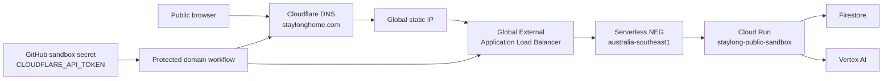

# StayLong public edge design

**Status:** approved design, pending implementation  
**Domain:** `staylonghome.com`  
**Target environment:** StayLong Sydney public sandbox (`stay-long`)

## Decision

StayLong will present a single branded public entry point at
`https://staylonghome.com`. A Global External Application Load Balancer (ALB)
will route traffic to the existing Sydney Cloud Run public-sandbox service
through a serverless network endpoint group (NEG). Google manages TLS for the
root and `www` hostnames; Cloudflare remains the registrar and authoritative
DNS provider.

The branded URL is a public demonstration environment. It retains the existing
public-sandbox privacy and approval boundaries: temporary cookie-owned
sessions, expiry cleanup, no real payments, no government-account submission,
and no real Gmail, calendar, or SMS sends.

## Goals

- Serve the app at `staylonghome.com` with HTTPS and a stable global IP.
- Redirect both HTTP and `www.staylonghome.com` to
  `https://staylonghome.com`.
- Make the load balancer the only external path to Cloud Run after validation.
- Manage GCP and Cloudflare DNS resources through Terraform and GitHub Actions.
- Keep the Cloudflare API token outside Git, Terraform configuration, outputs,
  and state.
- Preserve an explicit, evidence-producing manual workflow for provisioning,
  locking down, and destroying edge resources.

## Non-goals

- Do not create a production GCP project in this change.
- Do not change the registered domain, purchase domain add-ons, or use
  Cloudflare Workers or Pages.
- Do not implement end-user identity, payment, government-account, Gmail,
  calendar, or SMS integrations.
- Do not claim that the demo is a clinical, funding-eligibility, or emergency
  service.

## Architecture



Cloudflare DNS records remain **DNS-only** while Google provisions and renews
the managed certificate. The edge component owns the root and `www` records;
they must not be edited manually after Terraform takes ownership.

## Terraform ownership and state

Create `infra/terraform/components/public-edge` with an independent backend
prefix:

```text
staylong/sydney-sandbox/public-edge
```

The component reads the same checked-in project and environment JSON used by
the existing public sandbox. It owns:

- a global external IPv4 address;
- the required Compute API enablement;
- a regional serverless NEG targeting `staylong-public-sandbox` in
  `australia-southeast1`;
- external managed backend service, URL maps, HTTP redirect proxy, HTTPS
  proxy, forwarding rules, and logging;
- a Google-managed certificate for `staylonghome.com` and
  `www.staylonghome.com`;
- Cloudflare DNS A records for both hostnames.

The existing `public-sandbox` component remains the sole owner of the Cloud
Run service, its runtime identity, Firestore, Secret Manager secret, and
cleanup scheduler. It will own the later ingress/default-URL lockdown change.
No resource is declared in two Terraform states.

## DNS and TLS

The Cloudflare provider receives `CLOUDFLARE_API_TOKEN` only at workflow
runtime. Its token is limited to:

- `Zone:DNS:Edit`;
- `Zone:Zone:Read`;
- the `staylonghome.com` zone only.

The zone ID is non-secret configuration. The token is a GitHub `sandbox`
environment secret and is not a Terraform variable, output, or state value.

Terraform creates DNS-only A records for the root and `www` hostnames to the
reserved global IP. Google-managed TLS validates them and renews the
certificate. The provisioning workflow waits for certificate activation and
verifies HTTPS before any Cloud Run lockdown occurs.

## Two-phase rollout and rollback

### Phase A — provision and verify

1. Apply `public-edge`, while the existing Cloud Run `.run.app` endpoint
   remains available.
2. Wait for the certificate to be `ACTIVE`.
3. Run an anonymous browser-compatible smoke test against
   `https://staylonghome.com`: page assets, cookie session, and workflow
   creation must succeed.
4. Record the URL, certificate state, reserved IP, Cloud Run revision, image
   digest, and smoke-test result as a workflow artifact.

If TLS or the smoke test fails, do not change Cloud Run ingress. The existing
`.run.app` URL remains the rollback path while the cause is fixed.

### Phase B — lock down only after Phase A passes

1. Update the existing public-sandbox component to accept external traffic
   only from the load balancer (`internal-and-cloud-load-balancing`).
2. Disable the default Cloud Run URL where supported by the provider/API.
3. Rerun the branded-domain anonymous smoke test.

Rollback is a reviewed Terraform change that restores the prior Cloud Run
ingress/default URL behavior. It never deletes the domain registration.

## Protected workflows

Add `public-domain-control.yml`, manual-dispatch only from a commit reachable
from `main`:

| Operation | Confirmation | Result |
| --- | --- | --- |
| `provision` | `PROVISION_PUBLIC_DOMAIN` | Creates/updates DNS, TLS, and ALB; leaves Cloud Run direct access unchanged. |
| `lockdown` | `LOCKDOWN_PUBLIC_DOMAIN` | Requires a successful Phase-A proof, then restricts Cloud Run to the ALB. |
| `destroy` | `DESTROY_PUBLIC_EDGE` | Removes only edge and managed DNS resources; never deletes the Cloudflare registration. |

The workflow runs validation, Terraform plan/apply, and a branded-domain smoke
test. It authenticates to Google Cloud with existing GitHub OIDC/WIF and reads
the Cloudflare token from the `sandbox` environment secret.

Existing public-sandbox application deployments change their smoke-test target
to the branded domain only after Phase B is complete. Before then, they retain
the Cloud Run URL smoke test so deployments are not coupled to a pending
certificate.

## IAM and human setup

The GitHub Terraform operator needs the least privilege that can create the
edge resources. Bootstrap Terraform will declare the required Compute roles
for the operator; rollout validation will confirm the effective permissions
before apply. Google documents the related roles as Load Balancer Admin,
Network Admin, Compute Instance Admin (v1), and Security Admin.

The only human-owned secret setup is complete:

- Cloudflare custom token: `staylong-terraform-dns`;
- GitHub environment: `sandbox`;
- Secret name: `CLOUDFLARE_API_TOKEN`.

The private token runbook is deliberately outside the repository and contains
the rotation and revocation procedure.

## Acceptance criteria

- `https://staylonghome.com` serves the app with a valid Google-managed
  certificate.
- `http://staylonghome.com` and `https://www.staylonghome.com` redirect to
  the canonical HTTPS root hostname.
- The anonymous public workflow endpoint succeeds through the canonical URL.
- After Phase B, direct external access to the Cloud Run default URL is denied.
- Terraform state is remote, independent, and has no secret values.
- All new Terraform, workflow, configuration-schema, unit, and smoke tests
  pass before each protected apply.
- The destroy operation preserves the domain registration and records what it
  removed.

## References

- [Google: Global external ALB with Cloud Run](https://cloud.google.com/load-balancing/docs/https/setup-global-ext-https-serverless)
- [Google: restrict Cloud Run default endpoint](https://cloud.google.com/load-balancing/docs/https/setup-global-ext-https-serverless#restrict-ingress-on-default-endpoint)
- [Cloudflare Terraform provider](https://registry.terraform.io/providers/cloudflare/cloudflare/latest/docs/index)

