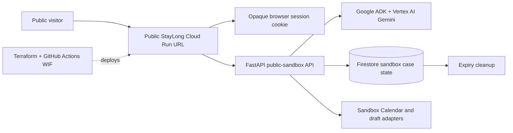

# StayLong public sandbox design

## Goal

Provide a publicly reachable StayLong URL that demonstrates the real product
workflow without exposing a shared API token, personal household information,
or real-world side effects.

The public sandbox is an application environment, not a static demo: it uses
the deployed FastAPI service, Google ADK and Vertex AI, and durable Firestore
case state. Every external action remains explicitly labelled and constrained
to a sandbox adapter.

## Intended experience

An unauthenticated visitor opens the generated Cloud Run URL and can:

1. describe a non-emergency home-living concern;
2. answer the assessment-preparation questions;
3. receive a Home Independence Plan and assessment-preparation pack;
4. independently approve or defer each proposed sandbox action; and
5. reopen the same browser and continue only their own temporary case.

The visitor must never see another visitor's case or any production case. The
experience must state that it is a public sandbox, uses no real providers, and
does not create a real calendar event, send mail, submit an application or
make a payment.

## Scope

### Included

- A dedicated `public-sandbox` Terraform component and isolated Cloud Run
  service with a generated `run.app` URL.
- Public Cloud Run invocation for this service only.
- A browser session established through an HttpOnly, Secure, SameSite=Lax
  cookie containing an opaque random identifier.
- Firestore ownership fields and API checks that scope every case lookup and
  workflow mutation to the current session identifier.
- Bounded anonymous use: request-size validation, a per-session workflow
  creation limit, and a short, documented retention period with automatic
  cleanup of expired sandbox cases.
- The normal Vertex AI / Google ADK workflow and Firestore persistence.
- Sandbox Calendar and contact-draft adapters only; no OAuth configuration,
  Google Calendar event, Gmail draft, provider contact or payment is enabled.
- Terraform-only creation, update and destroy operations through GitHub
  Actions WIF, plus end-to-end public-sandbox verification.

### Explicitly excluded

- Google sign-in, long-lived personal accounts and production user profiles.
- User-owned Google Calendar or Gmail OAuth connections.
- Importing real personal data, MyGov credentials, medical data or real
  provider records.
- Reusing the private production Cloud Run service or its API token.

## Architecture

The public Cloud Run IAM policy admits `allUsers` only to the dedicated
public-sandbox service. Application-level session ownership remains mandatory;
Cloud Run public invocation does not grant access to another session's data.

## Identity and ownership model

1. The first public request obtains a cryptographically random opaque session
   identifier. The raw identifier is held only in the browser cookie.
2. The backend derives a non-reversible session key for persisted ownership
   checks. It does not store the raw cookie value in Firestore or logs.
3. A new case stores its owner session key. Read, answer, approval and
   follow-through endpoints reject a case whose owner differs from the active
   session.
4. The private runtime keeps its existing service-to-service authentication.
   Its API-token contract is not enabled for the public-sandbox routes.
5. A session is not a personal account and provides no identity claim. It is
   deliberately short-lived and is not a basis for real external actions.

## Data retention and limits

- Sandbox data contains only non-clinical information entered for the demo.
- Cases receive an `expires_at` timestamp at creation. The cleanup worker
  deletes expired sandbox cases and their related approval, task and audit
  documents.
- The initial retention target is 24 hours. The exact value is configured by
  Terraform and shown in the privacy copy.
- A session may create a small fixed number of cases during its lifetime. The
  limit is enforced server-side, not only in the interface.
- Existing concern length limits remain in force. A public endpoint never
  accepts credentials, attachments or payment details.

## Safety and action boundary

- Emergency wording continues to bypass Gemini and presents Triple Zero (000)
  immediately.
- Every proposed action still needs an individual approval record.
- The public environment sets integration mode to `sandbox` and has no OAuth
  secret or permission to make an external call.
- The UI labels this boundary before approval and in the completed action
  result. It never call a sandbox result a real booking, email or calendar
  event.

## Deployment and operations

- Terraform owns the Cloud Run service, dedicated runtime service account,
  Firestore namespace/configuration, public invoker binding, runtime settings
  and observability resources.
- GitHub Actions deploys only through WIF after protected-environment approval.
- The deployment workflow returns the generated public URL and runs a browser
  equivalent smoke test without embedding a secret in the client.
- A teardown workflow destroys the public-sandbox component independently from
  the private service and shared Terraform state backend.

## Acceptance criteria

1. A visitor can use the public URL without a token or login.
2. A second browser session receives no access to the first session's case.
3. Reloading the first browser resumes its own active case before expiry.
4. The public workflow uses the configured ADK/Vertex and Firestore runtime,
   not the local in-memory demonstration runtime.
5. An approved public action produces a clearly labelled sandbox result and
   cannot call Google Calendar, Gmail, a provider, MyGov or a payment service.
6. Expired sandbox data is deleted by the documented cleanup path.
7. Private Cloud Run remains private and its API token remains absent from the
   public frontend, public logs and public Terraform outputs.
8. Automated API, ownership, browser-flow, Terraform and public deployment
   checks pass before release.
