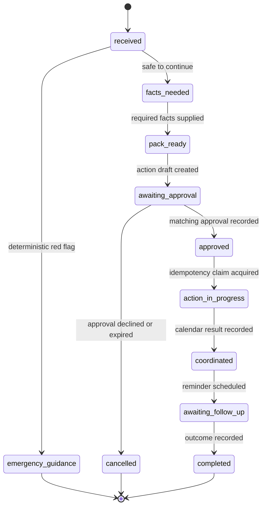

# StayLong improvements derived from the four ADK courses

## Product decision

StayLong will be a **durable household coordination workflow**, not a conversational assistant with several loosely connected agents. It may progress independently after an authorised household member starts a case, but it cannot bypass safety rules, consent boundaries or an explicit approval for an external action.

The decisions below derive from the official training linked in [official training guidance](official-training-guidance.md): [ADK orchestration patterns](https://cloudonair.withgoogle.com/events/architecting-multi-agent-teams-mastering-three-orchestration-patterns-adk-2), [long-running ADK workflows](https://cloudonair.withgoogle.com/events/build-long-running-agent-persistent-workflows-google-adk), [agent memory](https://cloudonair.withgoogle.com/events/architecting-agent-memory-session-state-vector-search-managed-cloud-memory), and [self-evolving agents](https://cloudonair.withgoogle.com/events/build-self-evolving-agent-autonomous-self-improvement).

## 1. Replace an implicit flow with an explicit case state machine

The ADK orchestration training distinguishes deterministic graph workflows from collaborative and dynamic patterns. StayLong's safety-critical path needs the first pattern.

**Implementation improvement**

- Define a closed `CaseStatus` enum and an allowed-transition table in Python. The model proposes structured facts or draft text; it never selects a forbidden transition.
- Model a small number of bounded ADK nodes: intake extraction, preparation-pack drafting and approved coordination drafting. Use a deterministic router for emergency, consent, status and approval decisions.
- Keep dynamic specialist selection out of the MVP. It is useful only if evaluation shows that a second specialist materially improves a non-safety node.

**Why it helps the submission:** judges can see where autonomy is real and where the product intentionally refuses to delegate safety to a model.

## 2. Make waiting, recovery and exactly-once action first-class

The long-running course's central failure mode is duplication after automatic recovery. StayLong has the same risk: a resume must never create a second calendar event or send a second escalation.

**Implementation improvement**

- Persist a workflow checkpoint after every state transition: `case_id`, state, state version, next wake-up time, approval reference, correlation ID and workflow version.
- Create an immutable action-intent record before calling Calendar. Its idempotency key is derived from `case_id + action_type + approval_id + action_revision`.
- Claim that key transactionally in Firestore. Only the holder may call the external adapter; a replay returns the already-recorded result.
- Use Cloud Tasks only to wake a case at a recorded time. A worker always re-reads the latest Firestore state before work; an old task becomes a safe no-op.
- Treat approval as a durable object with a scope, expiry, action revision and approver identity. A changed draft invalidates the earlier approval.

**Demo proof:** create an approved coordination event, deliberately replay the event or restart the service, then show one Calendar event and one immutable audit chain.

## 3. Use memory as a least-privilege context envelope

The memory course supports choosing among short-lived session state, durable structured state and searchable long-term memory. For the MVP, a vector store would increase privacy risk and complexity without proving the core workflow.

**Implementation improvement**

- Separate `conversation draft` (short-lived), `case facts` (durable, typed Firestore document), `consent and approval` (separate durable records), and `audit events` (append-only).
- Build each model call from a minimal context envelope: current status, permitted facts, missing facts and the exact task. Do not pass the full household history by default.
- Store the generated assessment-preparation pack as a versioned case artifact, not hidden model context. The user can review and approve the exact version.
- Add data retention metadata now: record purpose, data class, created time and deletion eligibility. Use synthetic data in the public demo.
- Defer semantic retrieval until a testable scenario needs it, such as a user-approved household preference document. Retrieval must remain opt-in, scoped and auditable.

**Why it helps the submission:** this makes "persistent context" credible while demonstrating data minimisation suitable for a sensitive ageing-in-place scenario.

## 4. Add an evaluation loop, not a self-changing live agent

The self-evolving course shows that a model can game a weak metric. In StayLong, an apparently complete care-coordination response is unsafe if it skipped a red-flag route, consent check or approval.

**Implementation improvement**

- Add a fixed synthetic evaluation suite with normal, incomplete-information, emergency, expired-approval, replay and delayed-reminder cases.
- Score both outcome and trajectory: correct state transition, no Gemini call for emergencies, no tool call without approval, no duplicate action after retry, and clear plain-language preparation pack.
- Record prompt version, model version, policy version, structured output and evaluation result. Changes are accepted only if they preserve every safety check and improve the chosen quality measure.
- Allow automated evaluation in CI; require pull-request review for prompt, policy and tool-contract changes. Do not enable runtime prompt rewriting or self-granting tool access.

**Demo proof:** show the evaluation report for a replay and emergency fixture alongside the live workflow.

## MVP changes, in priority order

| Priority | Change | Evidence in final demo |
| --- | --- | --- |
| P0 | Closed state machine, deterministic emergency and approval gates | State timeline visibly refuses unsafe transitions. |
| P0 | Firestore checkpoints, action intents and idempotency claims | Restart/replay produces exactly one Calendar event. |
| P0 | Cloud Tasks wake-up plus stale-task no-op check | A scheduled reminder continues without a chat session. |
| P1 | Minimal typed context envelope and versioned preparation-pack artifact | User sees exactly what data and draft are being approved. |
| P1 | Synthetic evaluation suite and CI report | Safety and autonomy claims are reproducible. |
| P2 | Additional specialist agent or opt-in retrieval | Add only if evaluation demonstrates a clear benefit. |

## Resulting product narrative

"When an older person raises a non-emergency concern, StayLong collects only the needed information, produces an assessment-preparation pack, waits for explicit approval, records a sandbox-safe coordination action, and then follows up on schedule—even if the service restarts. Every decision, approval and action is visible in the timeline."

This is a stronger Taskmaster demonstration than a generic care chatbot because the agent performs a bounded, real workflow autonomously over time and proves it did so safely.
